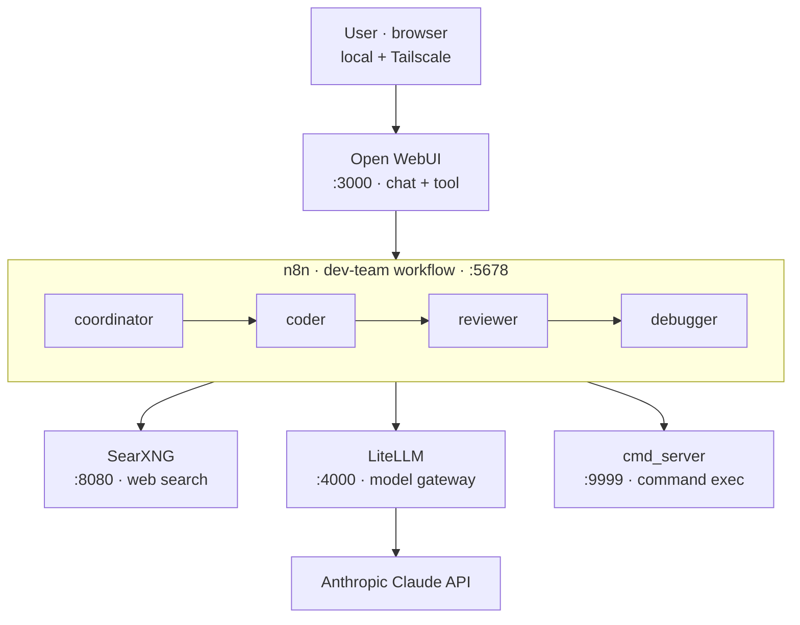

<p align="center">
  
</p>

<h1 align="center">Self-Hosted AI Agent Platform</h1>

<p align="center">
  A fully self-hosted, multi-agent LLM platform that runs an automated
  <b>coordinator → coder → reviewer → debugger</b> pipeline on commodity, CPU-only hardware.
</p>

<p align="center">
  
  
  
  
  
  
</p>

---

## Overview

This project is a complete, locally-hosted AI agent platform built entirely with
open-source components and orchestrated through Docker Compose. It exposes a chat
interface where a single request is handed to a **multi-agent pipeline** that plans,
writes, reviews, and debugs code automatically before returning a result.

Everything runs on a single Windows workstation (Intel i7-7700K, 16 GB RAM, **no GPU**).
Because local CPU-only inference is too slow for real work, every model alias in the
gateway is remapped to a hosted Claude model — so the orchestration is local while the
heavy reasoning is offloaded to a fast API. The whole stack is reachable remotely over a
private Tailscale network.

## Architecture



A request flows from the browser into **Open WebUI**, where a custom Python tool forwards
it to the **n8n** `dev-team` workflow. Inside that workflow the four agents run in sequence:
the **coordinator** breaks the task down, the **coder** implements it, the **reviewer**
checks the result, and the **debugger** fixes what the reviewer flags. The agents call
**SearXNG** for private web search and a lightweight **cmd_server** for executing shell
commands, and all model calls go through **LiteLLM**, which routes every alias to the
Anthropic Claude API.

## Components

| Service        | Port  | Role                                                        |
| -------------- | ----- | ---------------------------------------------------------- |
| Open WebUI     | 3000  | Chat front-end; hosts the Python tool that triggers agents |
| n8n            | 5678  | Workflow engine running the multi-agent pipeline           |
| LiteLLM        | 4000  | Unified model gateway (all aliases → Claude)               |
| SearXNG        | 8080  | Private metasearch used by agents for web research         |
| cmd_server     | 9999  | Minimal HTTP command runner (token-protected)              |
| PostgreSQL     | —     | Backing store for LiteLLM                                  |

## Key features

- **Multi-agent pipeline** — coordinator → coder → reviewer → debugger, defined as an
  n8n workflow and fully inspectable as JSON.
- **Agent factory** — a second workflow that scaffolds new agents from a template.
- **Single model gateway** — LiteLLM gives every service one OpenAI-compatible endpoint,
  so swapping providers means editing one config file.
- **Runs without a GPU** — orchestration is local and lightweight; inference is delegated.
- **Remote access by default** — Tailscale exposes the stack securely without opening ports.
- **Reproducible** — one `docker compose up` brings the whole platform online.

## Quick start

```bash
# 1. Clone
git clone https://github.com/lastbrink-pixel/ai-agent-platform.git
cd ai-agent-platform

# 2. Configure secrets
cp .env.example .env
cp litellm/config.example.yaml litellm/config.yaml
#   then edit .env and add your API key(s)

# 3. Launch
docker compose up -d
```

Then open Open WebUI at `http://localhost:3000`, import the workflows from
`n8n/workflows/` into n8n at `http://localhost:5678`, and start a chat.

## Project structure

```
ai-agent-platform/
├── docker-compose.yml          # full stack definition
├── .env.example                # environment template (no real secrets)
├── cmd_server.py               # token-protected HTTP command runner
├── litellm/
│   └── config.example.yaml     # model routing → Claude
├── n8n/
│   └── workflows/
│       ├── dev-team-workflow.json      # coordinator → coder → reviewer → debugger
│       └── agent-factory-workflow.json # scaffolds new agents
├── open-webui/
│   └── tools/                  # Python tool that calls the dev-team workflow
└── searxng/
    └── settings.yml            # search engine config
```

## Roadmap

- [ ] Per-agent metrics & token accounting
- [ ] Streaming responses back into Open WebUI
- [ ] Pluggable model providers via LiteLLM config only
- [ ] One-command deploy script

## License

Released under the MIT License.
